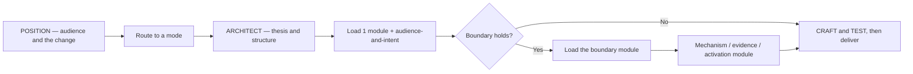

# Oratores

`oratores` is a skill package for Claude Code, Codex, and other agents that support `SKILL.md`. It helps an agent plan, design, draft, review and rehearse persuasive communication — a speech, keynote, pitch, deck, data story, town hall, announcement, executive briefing or campaign — without turning every request into a rhetoric lecture.

It combines a proportional execution model with **89 stable procedures** across 21 modules, synthesized from 38 works: the classical rhetorical canon, modern speechwriting and presentation practice, persuasion science, diffusion and change research, and propaganda analysis.

It is built to **offer options with their costs**, not to pick for you. Where two constructions produce different results, it gives both with the trade-off the source literature states for each, and the author decides.

## What is in the package

| Part | Contents |
|---|---|
| `skills/oratores` | the router: `SKILL.md`, 21 `references/*.md` modules, a genre playbook, a run-artifact schema, and 2 validators |
| `skills/speech-draft` | fork skill — write the actual words, for the ear, at a stated length |
| `skills/deck-build` | fork skill — design or repair a presentation, slide by slide |
| `skills/audience-strategy` | fork skill — map the audience and design the strategy before anything is written |
| `skills/persuasion-audit` | fork skill — audit a draft, or analyze someone else's message |
| `skills/exec-activation` | fork skill — turn an executive address into commitments, pilots and a cascade |
| `agents/oratores` | the orchestrator and the writer — holds the pen, and dispatches the specialists when the piece warrants them |
| `agents/oratores-strategist` | who the piece is for and what has to change in them — writes `brief.json` |
| `agents/oratores-evidence` | what it can honestly stand on, claims labelled on both axes — writes `evidence.json` |
| `agents/oratores-adversary` | the room's best objector, and what mechanism is carrying each passage — writes `objections.json` |
| `agents/oratores-invention` | generates the raw material before anything is selected — writes `candidates.json` |
| `agents/oratores-critic` | the independent reviewer — refutes, never fixes, and holds no write tools at all |
| `ui/` | an optional local panel that renders a run and writes back two things; nothing depends on it |

**Hook-free.** Nothing in the package requires a hook, because some environments forbid them by policy. The critic is read-only because `Write`, `Edit` and `Bash` are absent from its tool grant — a tool never granted is a mechanism, while a filter over commands is best-effort. The validators check that the grant has not drifted.

**One agent, or six.** Below a stated threshold you are one agent and write nothing but the deliverable; above it, four specialists produce structured fields into a run directory and one agent writes the prose. Which module each agent owns is a table in `agents/oratores.md`, and the validator fails the build if a module is owned twice or left unowned. The file contract is [`run-artifacts.md`](skills/oratores/references/run-artifacts.md) with a JSON Schema beside it. Three rules keep the parts from reading as parts: only the writer writes prose, a disagreement between two specialists becomes an open choice rather than a silent resolution, and `"unpriced"` is written where the literature states no cost — meaning unknown, not free.

## Why use it

- Start from the change required in a named audience, not from a template or a slide.
- Separate designing, drafting, reviewing and rehearsing — the four things that get collapsed and shouldn't be.
- Discover the boundaries an inexperienced communicator doesn't know to ask about: what a hostile room actually needs, what a number requires before it can be shown, what a behaviour change needs beyond a good argument.
- Turn a talk into commitments, owners, pilots and a cascade — the part that is normally missing.
- Keep claims labelled on two axes: type — fact, observation, interpretation, forecast, hypothesis, aspiration — and source status — checked, unverified, contradicted, recheck, not applicable. A type says nothing about whether anybody checked, so a fact nobody checked is recorded as exactly that.
- See what a mechanism costs before committing to it — including the costs that arrive late and are easy to leave out of a decision.
- Read someone else's campaign or pitch with the same machinery, pointed outward.

## How it works



The five operating modes:

1. **Explain** — answer a rhetorical concept or trade-off directly.
2. **Design** — produce the plan: audience map, objective, thesis, structure, evidence plan.
3. **Draft** — write the actual words, script, talking points, or slide-by-slide.
4. **Review** — inspect a draft, report findings before any verdict, don't rewrite.
5. **Rehearse** — produce the delivery artifact: marked script, timing, cut list, Q&A.

Design and Draft are separate on purpose. Drafting before the objective and thesis exist is the most common failure in this discipline, and editing does not recover from it.

## The form ladder

The package picks the *lightest sufficient* form, and will tell you when a deck is the wrong answer:

> one sentence said in person → an email or memo → a two-minute talk with no visuals → a talk with a handful of images → a fully narrated deck → a document plus a decision meeting → a repeated series → a campaign with owners and measurement

If a memo would persuade this audience better, it says so. Commencement, eulogy, apology, layoff, toast: no slides.

## Installation

Clone the repository, then copy the parts your agent supports.

### Claude Code

```bash
git clone https://github.com/IShalkin/oratores.git
mkdir -p ~/.claude/skills ~/.claude/agents
cp -R oratores/skills/. ~/.claude/skills/
cp oratores/agents/*.md ~/.claude/agents/
```

On Windows PowerShell:

```powershell
git clone https://github.com/IShalkin/oratores.git
New-Item -ItemType Directory -Force "$HOME\.claude\skills", "$HOME\.claude\agents" | Out-Null
Copy-Item -Recurse -Force .\oratores\skills\* "$HOME\.claude\skills\"
Copy-Item -Force .\oratores\agents\*.md "$HOME\.claude\agents\"
```

Copy **all five** skills, not only `oratores`: the four fork skills link into `../oratores/references/` and need it as a sibling directory.

To install project-scoped instead of globally, copy into `<your-project>/.claude/skills/` and `<your-project>/.claude/agents/`. The skills then load only when the agent runs from inside that project.

### Codex

Codex supports the skills, not the agents:

```bash
git clone https://github.com/IShalkin/oratores.git
mkdir -p ~/.codex/skills
cp -R oratores/skills/. ~/.codex/skills/
```

Restart the agent after installation if it does not refresh skills automatically.

## Usage

Invoke it explicitly:

```text
Use $oratores to draft a 20-minute talk for 500 managing directors on why our AI pilots aren't turning into capability.
```

Or ask naturally, where your agent supports automatic skill triggering:

```text
Review this deck before I send it to the board. What will they push back on?
```

```text
Map the audience for a town hall about the reorganization. Half of them think it's aimed at them.
```

```text
This chart is right and nobody understands it. Fix the chart, not the data.
```

```text
Explain when a change message should be a memo instead of a meeting, and what evidence would settle it.
```

Or reach a fork skill directly, when you want the analysis kept out of the main conversation:

```text
/exec-activation 500 MDs, 20 minutes, they agree about AI and nothing has changed. I need commitments and a cascade.
```

See [Usage patterns](docs/usage.md) for reusable prompts and what each returns.

## Methods

Documented in [Methods and decision model](docs/methods.md):

- **PACT**: Position → Architect → Craft → Test
- proportional execution and progressive context loading
- the form ladder, and when a deck is the wrong artifact
- the ten compound boundaries, and why a boundary is missed exactly when the request doesn't use its vocabulary
- claim labelling on two independent axes: type — fact / observation / interpretation / forecast / hypothesis / aspiration — and source status — checked / unverified / contradicted / recheck / not applicable
- mechanism selection by stated trade-off, plus the three sourced frames: durability, phase, and agitation vs. integration
- activation: commitment design, wins, cascade, routinization

## Genre playbooks

A playbook instantiates the modules for one recurring high-stakes genre — which procedures run, in what order, and what the finished deliverable contains.

| Playbook | Genre |
|---|---|
| [exec-ai-adoption](skills/oratores/references/playbooks/exec-ai-adoption.md) | An executive address that must convert a large, senior, message-fatigued audience into named commitments, owned pilots and a cascade — for AI or any comparable adoption |

Playbooks define no new procedures. See [playbooks/README.md](skills/oratores/references/playbooks/README.md) to add one.

## Mechanisms, including the propaganda ones

The package includes the full technical inventory of mass persuasion, propaganda techniques included. They are mechanisms: they work, they carry distinct documented costs, and which one fits depends entirely on the job. A message whose objective is speed of conviction in an emergency is a different problem from one that has to leave an organization able to think in two years, and both are real jobs.

So `MEC-01` gives the menu in the corpus's own format — **when to use it, and what it costs** — which is how the source literature states it, in roughly six hundred such blocks across thirty-five of the thirty-eight works. Three cross-cutting frames are sourced tables and marked as such: durability, phase, and the agitation/integration split that carries the time horizon. Where the literature gives no trade-off for a mechanism, none is invented; the entry is simply absent. The module does not pre-select an answer — that is the author's call and depends on context the package does not have.

`MEC-04` and `MEC-05` run the same machinery in reverse, for reading someone else's message. That direction is at least as useful as the first.

## What this package does not enforce

Everything here is text a model reads, and text can be declined. Two things only are mechanical: the **critic's tool grant** (no write tools, so it cannot alter what it reviews) and the **two validators** below. The review-debt rule, the module budget, the boundary pass and the seven-question cap are conventions the model follows, not gates that stop it.

It also does not police what you write. The one thing it holds to is not fabricating evidence — an invented statistic, study or benchmark is false work product, and it is also the fastest way to lose a room. Everything else is offered as a trade-off with its costs attached, for the author to weigh.

And the honest limit: nothing here can verify that a claim in a delivered piece was true, that a cited peer really adopted, or that an audience could in fact disagree. Those are properties of the world, checked by people. The package can require that they be checked; it cannot check them.

Read a green validator run as "the package is structurally intact", never as "the guidance was applied".

## Sources

38 works, listed with editions and known defects in [Sources](docs/sources.md). The package **is** the synthesis: no source pack is expected, pending, or installed later. What that costs is one kind of claim — an exact citation with chapter and page — which requires the source artifact at the time of the claim. Without it, the claim keeps its type and its source status is `UNVERIFIED`, or it is restated as synthesis and not attributed.

## Validation

```bash
python skills/oratores/scripts/validate_skill.py
python skills/oratores/scripts/check_links.py
```

The first checks layout, frontmatter, procedure-heading numbering, index coverage in both directions, module-map counts, the ten boundaries, fork-skill wiring, the critic's tool grant, and the agent roster — that every agent named in the ownership table exists, that no module is owned twice or left unowned, and that no specialist has lost the rule forbidding it to write prose. CI additionally validates every run artifact against the schema. The second checks that every relative link resolves. Both run on every push and pull request.

## License

[MIT](LICENSE)
